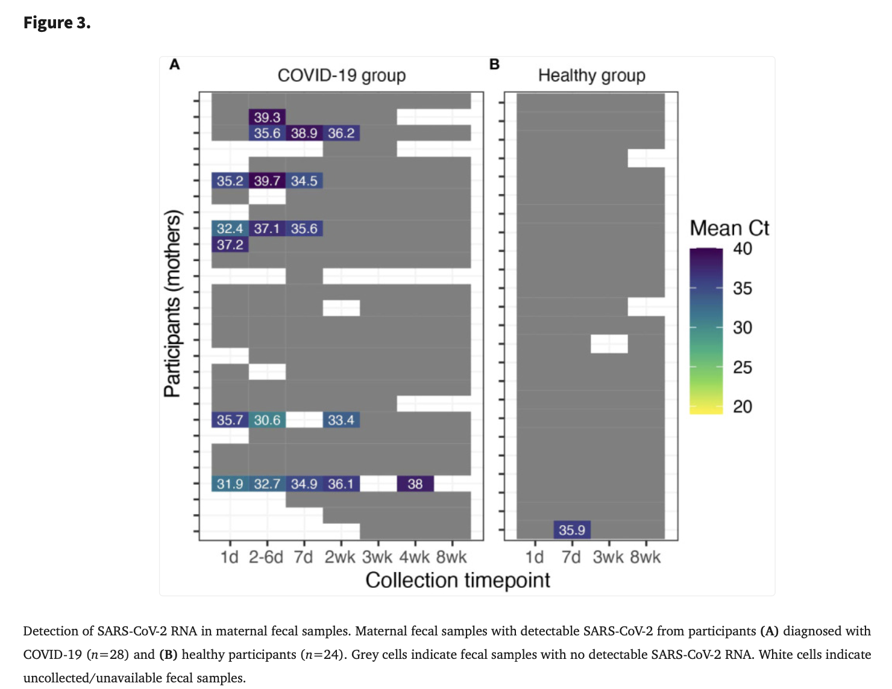
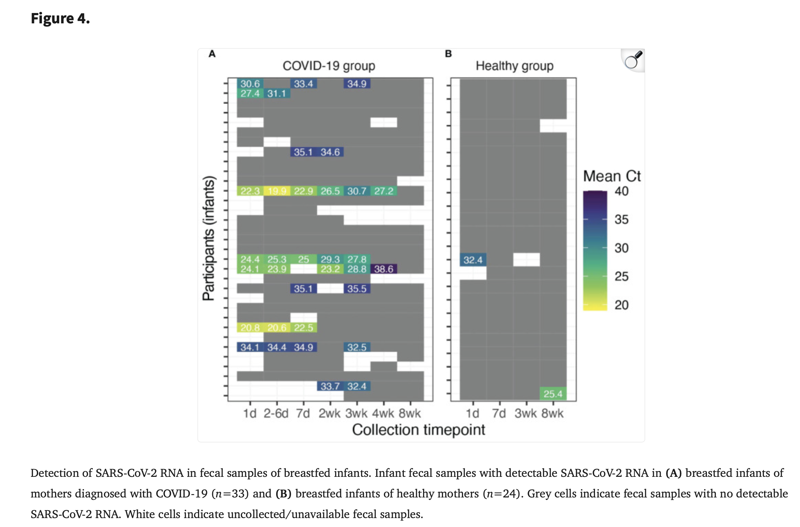

# Extraction for Pace et al. (2024)

[Pace et al. (2024)](https://pmc.ncbi.nlm.nih.gov/articles/PMC10996396/) examined whether and to what extent SARS-CoV-2 is detectable in the feces of lactating women and their breastfed infants following maternal COVID-19 diagnosis. This was a longitudinal study carried out from April 2020 to December 2021 involving 57 breastfeeding maternal-infant dyads: 33 dyads were enrolled as COVID-19 group with maternal COVID-19 diagnosis in the last 7 days, and 24 healthy dyads were served as controls. Maternal/infant fecal samples were collected by participants and analyzed for SARS-CoV-2 RNA. Follow-up surveys were administered via telephone over an 8-wk period following enrollment.

First, we `import` python modules needed:

```python
import yaml
import pandas as pd
from shedding_hub import folded_str
```

The raw data was extracted from Figure 3 (A, B) and Figure 4 (A, B) (see below) in Pace et al. (2024) and will be loaded and cleand in the markdown (.md) file.

 with URL: https://pmc.ncbi.nlm.nih.gov/articles/PMC10996396/figure/f3/
 with URL: https://pmc.ncbi.nlm.nih.gov/articles/PMC10996396/figure/f4/

```python
#load the data
pace2024 = pd.read_csv("data for pace2024prevalence.csv") 

# Initialize an empty list to store participant information
participant_list = []

# Group by participant and extract measurements
for patient_number, group in pace2024.groupby('Patient Number'):
    participant = {
        'measurements': []
    }

    for index, row in group.iterrows():
        if row['Ct Value'] == 0:
            value = "negative"
        else:
            value = float(row['Ct Value']) # convert ct value to number (single value form)
        measurementN = {
            'analyte': 'stool_SARSCoV2', 
            'time': int(row["Day"]),
            'value': value
        }
        participant['measurements'].append(measurementN)
    
    participant_list.append(participant)
```

Finally, the data is formatted and output as a YAML file.

```python
pace2024 = dict(title="Prevalence and duration of SARS-CoV-2 fecal shedding in breastfeeding dyads following maternal COVID-19 diagnosis",
               doi="10.3389/fimmu.2024.1329092",
               description=folded_str("This study examined whether and to what extent SARS-CoV-2 is detectable in the feces of lactating women and their breastfed infants following maternal COVID-19 diagnosis. A total of 57 maternal-infant dyads provided maternal and/or infant fecal samples, including 33 dyads in the COVID-19 group and 24 dyads in the healthy group. Fecal samples were collected from each mother and child in both the groups and telephone surveys administered during the first week following enrollment (1, 2-6 and 7 day) and again around 2, 3, 4, and 8 wk following enrollment for COVID-19 group, and two separate days during the first week after enrollment (1, 7 day) and again around 3 and 8 wk for healthy group. Since the author didn't provide the specific time information in the paper, we adopted mean value of time period as our data (4d for 2-6d, 11d for 2wk, 18d for 3wk, 25d for 4wk, 53d for 8wk).\n"),
               analytes=dict(stool_SARSCoV2=dict(description=folded_str("RNA isolated from fecal samples (including negative and positive controls) was used as the input for Quick SARS-CoV-2 multiplex reverse-transcription quantitative polymerase chain reaction (RT-qPCR) assay (cat. R3013, Zymo Research).\n"),
                                                    specimen="stool",
                                                    biomarker="SARS-CoV-2",
                                                    limit_of_quantification="unknown", 
                                                    limit_of_detection=40,
                                                    unit="cycle threshold",
                                                    reference_event="enrollment")),
               participants=participant_list)

with open("pace2024prevalence.yaml","w") as outfile:
    outfile.write("# yaml-language-server: $schema=../.schema.yaml\n")
    yaml.dump(pace2024, outfile, default_style=None, default_flow_style=False, sort_keys=False)
```