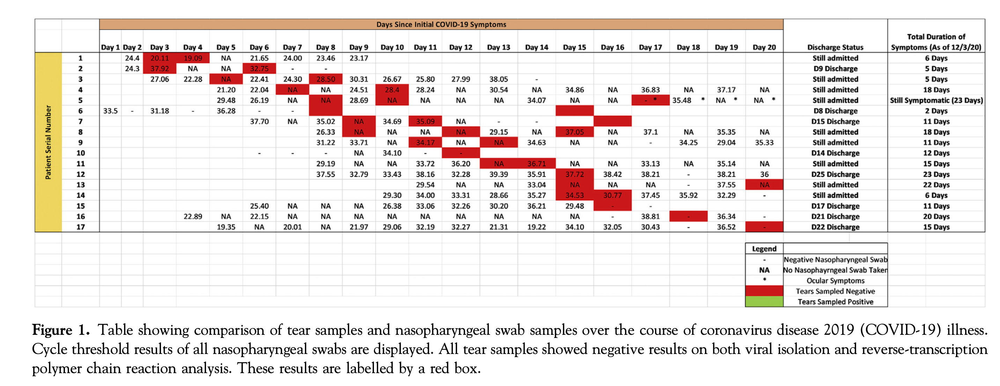

# Extraction for Seah et al. (2020)

[Seah et al. (2020)](https://www.aaojournal.org/article/S0161-6420(20)30311-0/fulltext) attempted to determine the possibility of transmission through tears by assessing for the presence of SARS- CoV-2 with viral isolation and quantitative reverse-transcription polymerase chain reaction (RT-PCR) analysis. As 17 patients were being monitored clinically via routine nasopharyngeal swabs, these results were compared with those of tears to understand further patterns of viral shedding. A total of 32 tear samples were obtained over the study period, with 6, 14, and 12 samples obtained from the first, second, and third week after initial symptoms onset, respectively. All tear samples showed negative results for SARS-CoV-2 on viral isolation and RT-PCR. The raw data is stored at [Shedding Hub](https://github.com/shedding-hub) which includes patient number,days since initial symptoms and ct value of nasopharyngeal swab sample results, demographic information about patients and ct value of tear samples are not recorded.

First, we `import` python modules needed:

```python
#import modules;
import yaml
import pandas as pd
from shedding_hub import folded_str
```

The raw data was extracted from Figure 1 (see below) in Seah et al. (2020) and remained needed data with excluding unrelated information.



```python
#load the data;
seah2020 = pd.read_csv("data for seah2020assessing.csv") 

# data preprocess: convert day time to integer and inspect NaN in ct value
seah2020['Days.Since.Initial.COVID-19.Symptoms']=seah2020['Days.Since.Initial.COVID-19.Symptoms'].str.extract(r'(\d+)')
seah2020['Days.Since.Initial.COVID-19.Symptoms']=seah2020['Days.Since.Initial.COVID-19.Symptoms'].astype(int) # convert series form
seah2020['ct value']= pd.to_numeric(seah2020['ct value'], errors='coerce') # substitute NaN for negative value

# Initialize an empty list to store participant information
participant_list = []

# Group by participant and extract measurements
for patient_number, group in seah2020.groupby('Patient Number'):
    participant = {
        'measurements': []
    }

    for index, row in group.iterrows():
        if pd.isna(row['ct value']):
            value = "negative"
        else:
            value = float(row['ct value']) # convert ct value to number (single value form)
        measurementN = {
            'analyte': 'nasopharyngeal_swab_SARSCoV2', 
            'time': int(row['Days.Since.Initial.COVID-19.Symptoms']),
            'value': value
        }
        participant['measurements'].append(measurementN)
    
    participant_list.append(participant)

```

Finally, the data is formatted and output as a YAML file.

```python
Seah2020 = dict(title="Assessing Viral Shedding and Infectivity of Tears in Coronavirus Disease 2019 (COVID-19) Patients",
               doi="10.1016/j.ophtha.2020.03.026",
               description=folded_str('This study investigated the potential transmission of SARS-CoV-2 through tears by detecting the virus using viral isolation and quantitative reverse-transcription polymerase chain reaction (RT-PCR) analysis. A total of 17 COVID-19 patients were enrolled in this prospective study in Singapore after obtaining informed consent. Researchers collected 135 nasopharyngeal swab samples and 32 tear samples throughout the study (all tear samples showed negative results for SARS-CoV-2 on viral isolation and RT-PCR). No evidence of SARS-CoV-2 shedding in tears was observed during the course of the disease. In conclusion, the findings suggest that the risk of SARS-CoV-2 transmission through tears is minimal.\n'),
               analytes=dict(nasopharyngeal_swab_SARSCoV2=dict(description=folded_str("The presence of SARS-CoV-2 is assessed with viral isolation and quantitative reverse-transcription polymerase chain reaction (RT-PCR) analysis for patients' nasopharyngeal swabs. \n"),
                                                    specimen="nasopharyngeal_swab",
                                                    biomarker="SARS-CoV-2",
                                                    limit_of_quantification='unknown', 
                                                    limit_of_detection='unknown',
                                                    unit="cycle threshold",
                                                    reference_event="symptom onset")),
               participants=participant_list)

with open("seah2020assessing.yaml","w") as outfile:
    outfile.write("# yaml-language-server: $schema=../.schema.yaml\n")
    yaml.dump(Seah2020, outfile, default_style=None, default_flow_style=False, sort_keys=False)
```
