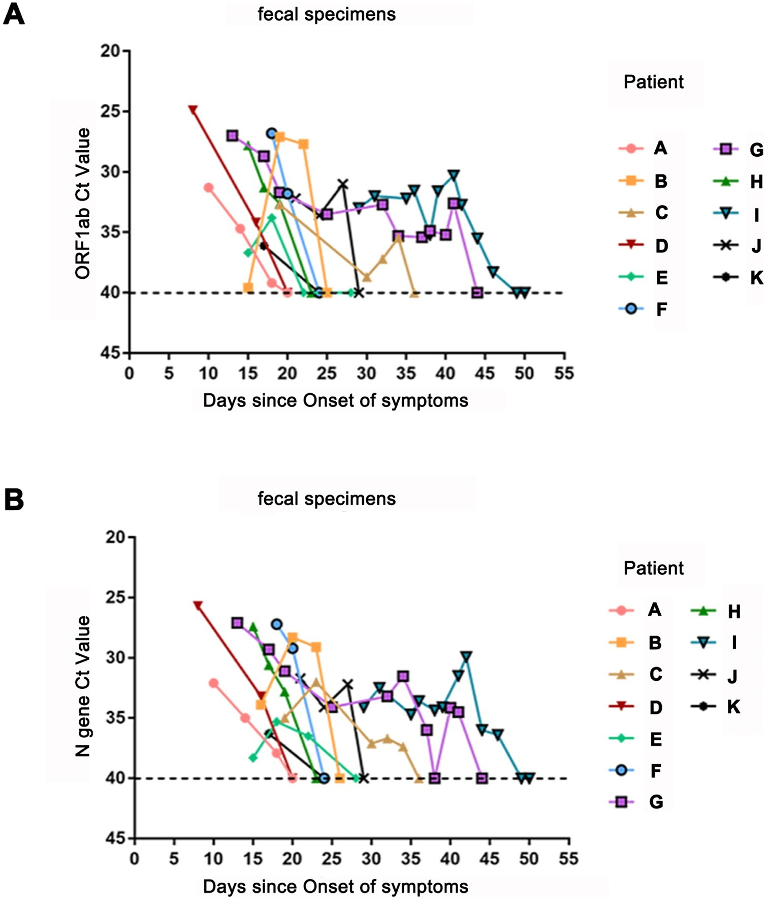

# Data Extraction for Wang et al. (2020)
In [Wang et al. (2020)](https://doi.org/10.1016/j.virusres.2020.198147), 69 COVID-19 patients were included. SARS-CoV-2 RNA was tested in stool and respiratory specimens until two sequential negative results were obtained. Clinical, laboratory and imaging data were recorded. The data used in this study was extracted from **Figure 1** of the [Wang et al. (2020)](https://doi.org/10.1016/j.virusres.2020.198147) using [https://automeris.io/](https://automeris.io/), a tool for extracting numerical data from images of graphs. The extracted data was saved into two `.xlsx` files:

- **`A data.xlsx`** → Corresponds to **ORF1ab gene measurements**
- **`B data.xlsx`** → Corresponds to **N gene measurements**

These two files contain the cycle threshold (Ct) values for SARS-CoV-2 RNA in fecal samples, with respect to the **days since symptom onset**.
## Source Figure
The figure below represents the data used in this study:


The following Python script was used to process the extracted data:

```python
import yaml
import pandas as pd
from shedding_hub import folded_str
```


```python
df_a = pd.read_excel("A data.xlsx")
df_b = pd.read_excel("B data.xlsx")
df_a.columns = ["patients", "days", "ctvalue"]
df_b.columns = ["patients", "days", "ctvalue"]
df_a["days"] = df_a["days"].astype(int)
df_b["days"] = df_b["days"].astype(int)
df_a["ctvalue"] = pd.to_numeric(df_a["ctvalue"], errors="coerce")
df_b["ctvalue"] = pd.to_numeric(df_b["ctvalue"], errors="coerce")
```


```python
df_merged = pd.merge(df_a, df_b, on=["patients", "days"], how="outer", suffixes=("_ORF1ab", "_N"))
```

```python
from decimal import Decimal, ROUND_HALF_UP

def round_half_up(n):
    return int(Decimal(str(n)).quantize(Decimal('1'), rounding=ROUND_HALF_UP))

```

```python
participants = []
for patient_id, patient_data in df_merged.groupby("patients"):
    participant = {
        "measurements": []
    }

    for _, row in patient_data.iterrows():
        if pd.notna(row["ctvalue_ORF1ab"]):
            measurement_orf1ab = {
                "analyte": "stool_SARSCoV2_ORF1ab",
                "time": round_half_up(row["days"]),
                "value": float(row["ctvalue_ORF1ab"]) if float(row["ctvalue_ORF1ab"]) < 40 else "negative"
            }
            participant["measurements"].append(measurement_orf1ab)

        if pd.notna(row["ctvalue_N"]):
            measurement_n = {
                "analyte": "stool_SARSCoV2_N",
                "time": round_half_up(row["days"]),
                "value": float(row["ctvalue_N"]) if float(row["ctvalue_N"]) < 40 else "negative"
            }
            participant["measurements"].append(measurement_n)

    if participant["measurements"]:
        participants.append(participant)
```

```python
output_data = {
    "title": "Fecal viral shedding in COVID-19 patients: Clinical significance, viral load dynamics and survival analysis",
    "doi": "10.1016/j.virusres.2020.198147",
    "description": folded_str("This study investigates the fecal shedding of SARS-CoV-2 in COVID-19 patients, analyzing viral load dynamics, clinical significance, and survival analysis.\n"),
    "analytes": {
        "stool_SARSCoV2_ORF1ab": {
            "description": folded_str("qPCR analysis of SARS-CoV-2 RNA in stool samples targeting ORF1ab gene. Ct less than 35 is defined as positive, and Ct > 40 is considered as negative.\n"),
            "specimen": "stool",
            "biomarker": "SARS-CoV-2",
            "gene_target": "ORF1ab",
            "limit_of_quantification": "unknown", 
            "limit_of_detection": 40,
            "unit": "cycle threshold",
            "reference_event": "symptom onset"
        },
        "stool_SARSCoV2_N": {
            "description": folded_str("qPCR analysis of SARS-CoV-2 RNA in stool samples targeting N gene. Ct = 35 is the cut-off for a positive result, and Ct = 40 is a negative sample.\n"),
            "specimen": "stool",
            "biomarker": "SARS-CoV-2",
            "gene_target": "N",
            "limit_of_quantification": "unknown",  
            "limit_of_detection": 40,
            "unit": "cycle threshold",
            "reference_event": "symptom onset"
        }
    },  
    "participants": participants
}
with open("wang2020fecal.yaml","w") as outfile:
    outfile.write("# yaml-language-server:$schema=../.schema.yaml\n")
    yaml.dump(output_data, outfile, default_flow_style=False, sort_keys=False)
```
