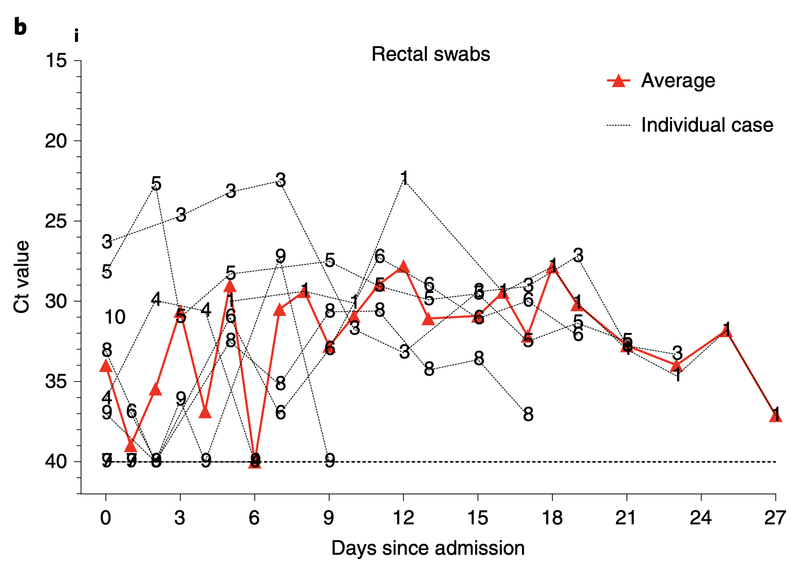
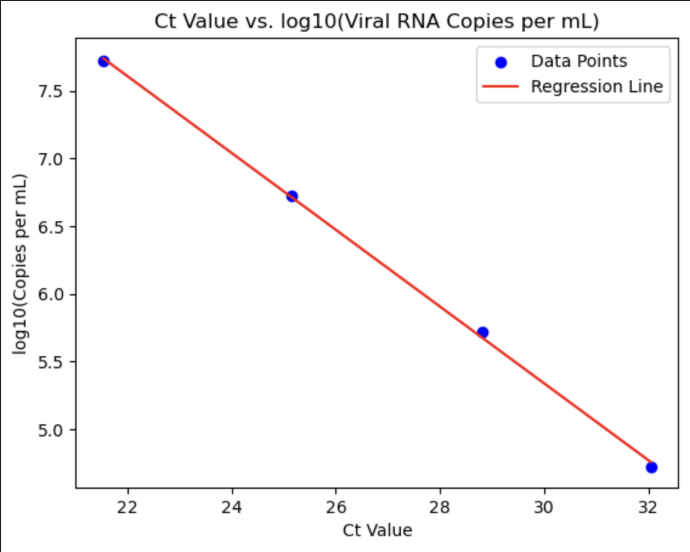

# Extraction for Xu et al. (2020)

[Xu et al. (2020)](https://www.nature.com/articles/s41591-020-0817-4) reported the epidemiological and clinical features of ten children infected with SARS-CoV-2 confirmed by real-time reverse transcription PCR assay of SARS-CoV-2 RNA and tested for evidence of viral excretion through the gastrointestinal and respiratory tracts. The dataset includes demographic information (sex, age) of each patients and detected viral load in both of nasopharyngeal and rectal swabs recorded by days after admission.

First, we `import` python modules needed:

```python
#import modules;
import yaml
import numpy as np
import pandas as pd
from shedding_hub import folded_str
```

We extracted the raw data using [automeris.io](https://automeris.io/) from Figure 1 (b) (see below) in [Xu et al. (2020)](https://www.nature.com/articles/s41591-020-0817-4/figures/1). The extracted data, which is stored on [Shedding Hub](https://github.com/shedding-hub/shedding-hub/tree/main/data/xu2020characteristics), was loaded and cleaned to match the most updated [schema](https://github.com/shedding-hub/shedding-hub/blob/main/data/.schema.yaml).


[!image](patient_data_nasopharyngeal.png)

```python
Xu2020 = pd.read_csv("data for xu2020characteristics.csv")
# Substitute 40 for rows where 'Ct Value' is between 39 and 41
Xu2020.loc[(Xu2020['Ct Value'] >= 39) & (Xu2020['Ct Value'] <= 41), 'Ct Value'] = 40

from sklearn.linear_model import LinearRegression
# import matplotlib.pyplot as plt
# establish transformation model between ct value and viral load provided four pairs of point by author
def ct_transformation_vl(ct_values, copies_per_ml):
   X = ct_values.reshape(-1, 1)
   Y = np.log10(copies_per_ml)
   model = LinearRegression()
   model.fit(X, Y)
   slope = model.coef_[0]
   intercept = model.intercept_
   print(f"Model Equation: log10(Copies per mL) = {slope:.4f} * Ct + {intercept:.4f}")
   # Plot the regression line
   #plt.scatter(X, Y, label="Data Points", color='blue')
   #plt.plot(ct_values, model.predict(X), label="Regression Line", color='red')
   #plt.xlabel("Ct Value")
   #plt.ylabel("log10(Copies per mL)")
   #plt.title("Ct Value vs. log10(Viral load Copies per mL)")
   #plt.legend()
   #plt.show() 
   return slope, intercept
ct_values = np.array([32.04, 28.81, 25.14, 21.54])
copies_per_ml = np.array([5.27e4, 5.27e5, 5.27e6, 5.27e7])
slope, intercept = ct_transformation_vl(ct_values, copies_per_ml)
```



Cycle threshold (`Ct`) values were plotted against the corresponding viral load (VL) values per swab in the figure above. A linear regression was performed to obtain the slope and intercept of the standard curve and serves as the basis for converting `Ct` values into viral load concentration based on four pairs of points provided by the author.

The derived standard curve equation is adjusted into an exponential format. Thus, for each `Ctvalue` in the `xu2020` dataset, the viral load is calculated as $\text{concentration} = 10^{(13.8596 + (-0.2841) \times \text{Ctvalue})}$, except for a `Ctvalue` of 40, which defaults to a concentration of 1 to account for undetectable viral loads.

```python
# Transform Ct value to viral load (copies per ml) using obtained standard curve
Xu2020['Viral Load'] = np.where(Xu2020['Ct Value'] == 40, 1, 10 ** (intercept + slope * Xu2020['Ct Value']))
# Transform age into unit of year
Xu2020['Age_years'] = Xu2020['Age'] / 12

# Initialize an empty list to store participant information
participant_list = []

# Loop through each unique PatientID in the filtered dataset
for patient_id in pd.unique(Xu2020["Patient Number"]):
    patient_data = Xu2020[Xu2020["Patient Number"] == patient_id]
    
    # Extract age and sex
    age = float(patient_data['Age_years'].iloc[0])
    sex = str(patient_data['Sex'].iloc[0])

    measurements = []
    # Iterate over each time point
    for _, row in patient_data.iterrows():
        if row['Specimen'] == 'rectal swab':
           if row['Viral Load'] == 1:
              value = "negative"
           else:
              value = row['Viral Load']
           measurementN = {
            'analyte': 'rectal_swab_SARSCoV2',
            'time': round(row['Day']),
            'value': value
            }
           measurements.append(measurementN)

    for _, row in patient_data.iterrows():
        if row['Specimen'] == 'nasopharyngeal swab':
           if row['Viral Load'] == 1:
              value = "negative"
           else:
              value = row['Viral Load']
           measurementN = {
            'analyte': 'nasopharyngeal_swab_SARSCoV2',
            'time': round(row['Day']),
            'value': value
            }
           measurements.append(measurementN)

    participant = {
        "attributes": {
            "age": age,
            "sex": sex
        },
        "measurements": measurements
    }
    participant_list.append(participant)
```

Finally, the data is formatted and output as a YAML file.

```python
Xu2020 = dict(title="Characteristics of pediatric SARS-CoV-2 infection and potential evidence for persistent fecal viral shedding",
               doi="10.1038/s41591-020-0817-4",
               description=folded_str('This study reported the epidemiological and clinical features of ten children infected with SARS-CoV-2 confirmed by real-time reverse transcription PCR assay of SARS-CoV-2 RNA and tested for evidence of viral excretion through the gastrointestinal and respiratory tracts. A total of 107 samples in both of nasopharyngeal and rectal swabs were collected and ct values were recorded by days after admission. The standard curve of transforming ct value into viral load was calculated based on the concentration provided by the author.\n'),
               analytes=dict(rectal_swab_SARSCoV2=dict(description=folded_str("SARS-CoV-2 RNA copy number concentration in rectal swab samples. The unit of concentration were converted to copies per ml from Ct values based on standard curve calculated from the concentration provided by the author.\n"),
                                                    specimen="rectal_swab",
                                                    biomarker="SARS-CoV-2",
                                                    gene_target="ORF1ab, N", 
                                                    limit_of_quantification='unknown', 
                                                    limit_of_detection=312, 
                                                    unit="gc/mL", 
                                                    reference_event="hospital admission"), 
                             nasopharyngeal_swab_SARSCoV2=dict(description=folded_str("SARS-CoV-2 RNA copy number concentration in nasopharyngeal swab samples. The unit of concentration were converted to copies per ml from Ct values based on standard curve calculated from the concentration provided by the author.\n"),
                                              specimen="nasopharyngeal_swab",
                                              biomarker="SARS-CoV-2",
                                              gene_target="ORF1ab, N",
                                              limit_of_quantification="unknown",
                                              limit_of_detection=312,
                                              unit="gc/mL",
                                             reference_event="hospital admission")), 

               participants=participant_list)

with open("xu2020characteristics.yaml","w") as outfile:
    outfile.write("# yaml-language-server: $schema=../.schema.yaml\n")
    yaml.dump(Xu2020, outfile, default_style=None, default_flow_style=False, sort_keys=False)
```