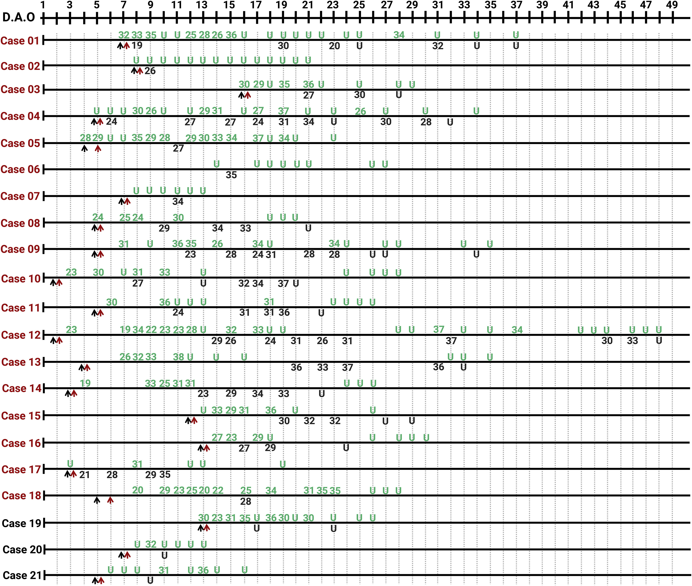
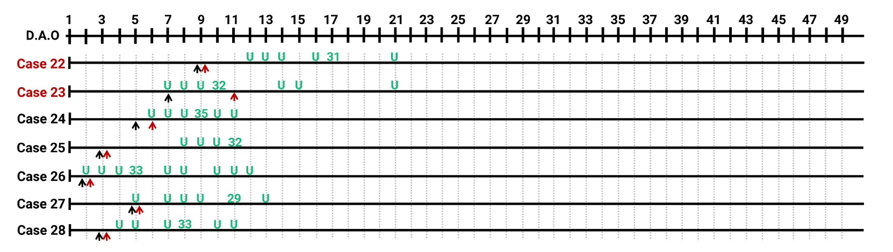

# Extraction for Yang et al. (2020)

[Yang et al. (2020)](https://doi.org/10.1016/j.xinn.2020.100061) involved 3552 clinical samples from 410 COVID-19 patients confirmed by Guangdong CDC (Center for Disease Control and Prevention). Oropharyngeal swabs, nasopharyngeal swabs, and sputum samples were tested for upper respiratory tract infection, while bronchoalveolar lavage fluid (BALF) was tested for lower respiratory tract infection.
The manuscript did not provide detailed sample type for each test.
Days shown in the dataset are days after illness onset (d.a.o.). The raw data was extracted from Figure 2 and Figure S1 (see below) in [Yang et al. (2020)](https://doi.org/10.1016/j.xinn.2020.100061).

**Figure 2 Serial Detection of Viral RNA in Different Sites of the Respiratory Tract from 21 COVID-19 Cases**



*Numbers of cases from severe and mild groups are marked in red and black, respectively. The detection results of samples from the upper respiratory tract are in green, and from the lower respiratory tract (BALF) in black. Lower cycle threshold (Ct) values indicate higher viral loads. The black and red arrows indicate hospital admission and the start of antiviral treatment, respectively.*

**Figure S1. Serial detection of viral RNA in 7 COVID-19 cases from whomSARS-CoV-2 RNA was not detected in the upper respiratory specimens for at least the first 3 times.**



*Numbers of cases from severe and mild groups were markedin red and black, respectively. The detection results of samples from upper respiratorytract were in green, and lower respiratory tract in black. Lower cycle threshold (Ct) values indicate higher viral loads. The black and red arrows indicate hospital admission and the start of antiviral treatment, respectively.*

```python
#import modules;
import yaml
import pandas as pd
import numpy as np
from shedding_hub import folded_str
```


```python
#load the data;
df = pd.read_excel('data.xlsx')

```


```python
#Create patient specific dataset and visit level data
dat_pat = df[df['Resp_tract'] == 'upper'].loc[:,['Case','Sex','Age','Adm_day','treat_day']]
#Change na to "unknown"
dat_pat = dat_pat.fillna('unknown')
dat_pat['Sex'] = dat_pat['Sex'].replace({'M':'male','F':'female'})

```


```python
#Create long format data
dat_long = df.drop(columns = ['Sex','Age','Adm_day','treat_day']).melt(id_vars = ['Case','Resp_tract'],var_name = 'days',value_name = 'ct_value')
#Filter to no missing data
dat_long = dat_long[~dat_long['ct_value'].isnull()].sort_values(by = ['Case','Resp_tract','days'])
#Change the "u" to "negative"
dat_long.loc[dat_long['ct_value'] == 'u','ct_value'] = 'negative'
```


```python
#Output Yaml file
#Enter the yaml writing stage
participant_list = [dict(attributes=dict(age=dat_pat.loc[dat_pat.loc[dat_pat["Case"]==i].index[0],'Age'],
                            sex=dat_pat.loc[dat_pat.loc[dat_pat["Case"]==i].index[0],'Sex']),
                            measurements=[dict(analyte='lower_resp_tract',time=j,
                                            value=dat_long.loc[(dat_long['days'] == j) & (dat_long['Case'] == i) & (dat_long['Resp_tract'] == 'lower'),"ct_value"].item()) for j in np.unique(dat_long.loc[(dat_long['Case'] == i) & (dat_long['Resp_tract'] == 'lower'),'days'])]+
                                            [dict(analyte='upper_resp_tract',time=j,
                                            value=dat_long.loc[(dat_long['days'] == j) & (dat_long['Case'] == i) & (dat_long['Resp_tract'] == 'upper'),"ct_value"].item()) for j in np.unique(dat_long.loc[(dat_long['Case'] == i) & (dat_long['Resp_tract'] == 'upper'),'days'])]) for i in np.unique(dat_pat['Case'])]
```


```python
yangproj = dict(title="Laboratory Diagnosis and Monitoring the Viral Shedding of SARS-CoV-2 Infection",
               doi="10.1016/j.xinn.2020.100061",
               description=folded_str('This study involved 3552 clinical samples from 410 COVID-19 patients confirmed by Guangdong CDC. Oropharyngeal swabs, nasopharyngeal swabs and sputum samples were tested for upper respiratory tract infection, while bronchoalveolar lavage fluid (BALF) was tested for lower respiratory tract infection.\n'),
               analytes=dict(upper_resp_tract=dict(description=folded_str("SARS-CoV-2 RNA ct value from evaluation of upper respiratory tract samples.\n"),
                                                    specimen=["nasopharyngeal_swab","oropharyngeal_swab", "sputum"],
                                                    biomarker="SARS-CoV-2",
                                                    gene_target="ORF1ab and N gene",
                                                    limit_of_quantification="unknown",
                                                    limit_of_detection=38,
                                                    unit="cycle threshold",
                                                    reference_event="symptom onset"),
                             lower_resp_tract=dict(description=folded_str("SARS-CoV-2 RNA ct value from evaluation of upper respiratory tract samples.\n"),
                                                    specimen="bronchoalveolar_lavage_fluid",
                                                    biomarker="SARS-CoV-2",
                                                    gene_target="ORF1ab and N gene",
                                                    limit_of_quantification="unknown",
                                                    limit_of_detection=38,
                                                    unit="cycle threshold",
                                                    reference_event="symptom onset")),
               participants=participant_list)

```


```python
with open("yang2020laboratory.yaml","w") as outfile:
    outfile.write("# yaml-language-server: $schema=../.schema.yaml\n")
    yaml.dump(yangproj, outfile, default_style=None, default_flow_style=False, sort_keys=False)
```
