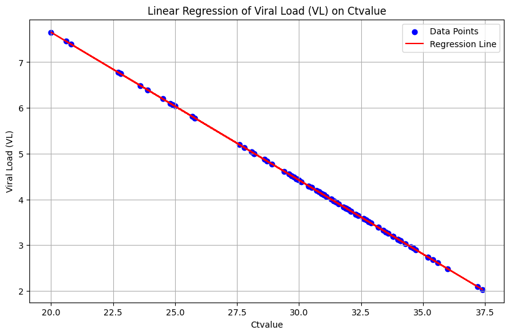

# Extraction of Young et al. (2020) using the data published by Challenger et al. (2022) and Goyal et al. (2020)

[Young et al. (2020)](https://jamanetwork.com/journals/jama/fullarticle/2762688) collected clinical, laboratory, and radiologic data, including PCR cycle threshold values from nasopharyngeal swabs and viral shedding in blood, urine, and stool. The clinical course was summarized, including the requirement for supplemental oxygen, intensive care, and the use of empirical treatment with lopinavir-ritonavir. The numbers of positive stool, blood, and urine samples were small. Data for the nasopharyngeal swab results were obtained from the combined dataset in the supplementary materials of [Challenger et al. (2022)](https://doi.org/10.1186/s12916-021-02220-0). The standard curve was calculated based on the concentration provided by [Goyal et al. (2020)](https://www.science.org/doi/10.1126/sciadv.abc7112). 

First, we `import` python modules needed:

```python
#import modules;
import yaml
import pandas as pd
import numpy as np
from shedding_hub import folded_str, literal_str
```

Raw data ([CombinedDataset](https://github.com/shedding-hub/shedding-hub/blob/main/data/young2020epidemiologic/CombinedDataset.xlsx)), which is stored on [Shedding Hub](https://github.com/shedding-hub), will be loaded and cleaned to match the most updated [schema](https://github.com/shedding-hub/shedding-hub/blob/main/data/.schema.yaml).

```python
df = pd.read_excel('CombinedDataset.xlsx', sheet_name='Viral_Load')
young2020 = df[df['StudyNum'] == 6].copy()
columns_to_drop = ['Estimated', 'SevMax', 'Sev1st', 'Died', 'SevMax3']
young2020 = young2020.drop(columns=columns_to_drop)
```
## Standard Curve Back-Calculation for Viral Load Estimation

The standard curve for converting `Ct` values to viral load per swab was established using a linear regression model based on data from the [Goyal et al. (2020)](https://www.science.org/doi/10.1126/sciadv.abc7112) dataset.

```python
from sklearn.linear_model import LinearRegression
Young2020 = pd.read_csv("Viral_Loads.csv")
Young2020 = Young2020[Young2020["cov_study"]==1]
Young2020 = Young2020[Young2020['Ct'] != 40]
X = Young2020['Ct'].values.reshape(-1, 1)
Y = Young2020['VL'].values
model = LinearRegression()
model.fit(X, Y)
predictions = model.predict(X)
slope = model.coef_[0]
intercept = model.intercept_
print(f"Slope: {slope}")
print(f"Intercept: {intercept}")
```


Cycle threshold values were plotted against the corresponding viral load (VL) values per swab in the figure above. A linear regression was performed to obtain the slope and intercept of the standard curve and serves as the basis for converting `Ct` values from other samples in [Challenger et al. (2022)](https://doi.org/10.1186/s12916-021-02220-0) into viral load concentration.

The derived standard curve equation is adjusted into an exponential format. Thus, for each `Ctvalue` in the `young2020` dataset, the viral load is calculated as \( \text{concentration} = 10^{(14.1147 - 0.3231 \times \text{Ctvalue})} \), except for a `Ctvalue` of 38, which defaults to a concentration of 1 to account for undetectable viral loads.


```python
# Transform Ct value to gc/swab using obtained standard curve
young2020['concentration'] = np.where(young2020['Ctvalue'] == 38, 1, 10 ** (intercept - slope * young2020['Ctvalue']))
participants = []
# Group by participant and extract measurements
for patient_id, group in young2020.groupby('PatientID'):
    participant = {
        'measurements': []
    }

    for _, row in group.iterrows():
        if row['concentration'] == 1:
            value = "negative"
        else:
            value = row['concentration']
        measurementN = {
            'analyte': 'swab_SARSCoV2_N',
            'time': row['Day'],
            'value': value
        }
        participant['measurements'].append(measurementN)
        
    participants.append(participant)
```

Finally, the data is formatted and output as a YAML file.

```python
young2020epidemiologic = dict(title="Epidemiologic Features and Clinical Course of Patients Infected With SARS-CoV-2 in Singapore",
               doi="10.1001/jama.2020.3204",
               description=folded_str('Clinical, laboratory, and radiologic data were collected, including PCR cycle threshold values from nasopharyngeal swabs and viral shedding in blood, urine, and stool. The clinical course was summarized, including the requirement for supplemental oxygen, intensive care, and the use of empirical treatment with lopinavir-ritonavir. The numbers of positive stool, blood, and urine samples were small. Data for the nasopharyngeal swab results were obtained from the combined dataset in the supplementary materials of Challenger et al. (2022). The standard curve was calculated based on the concentration provided by Goyal et al. (2020).\n'),
               analytes=dict(swab_SARSCoV2_N=dict(description=folded_str("SARS-CoV-2 RNA genome copy concentration in nasopharyngeal swab samples. The unit of concentration were converted to gc/swab from Ct values based on standard curve calculated from the concentration provided by Goyal et al. (2020).\n"),
                                        limit_of_quantification="unknown",
                                        limit_of_detection="unknown",
                                        specimen="nasopharyngeal_swab", 
                                        biomarker="SARS-CoV-2", 
                                        gene_target="N, E, and ORF1lab", 
                                        unit="gc/swab",
                                        reference_event="symptom onset",)),
                participants = participants
                                        )

with open("young2020epidemiologic.yaml","w") as outfile:
    outfile.write("# yaml-language-server: $schema=../.schema.yaml\n")
    yaml.dump(young2020epidemiologic, outfile, default_flow_style=False, sort_keys=False)
outfile.close() 
```
