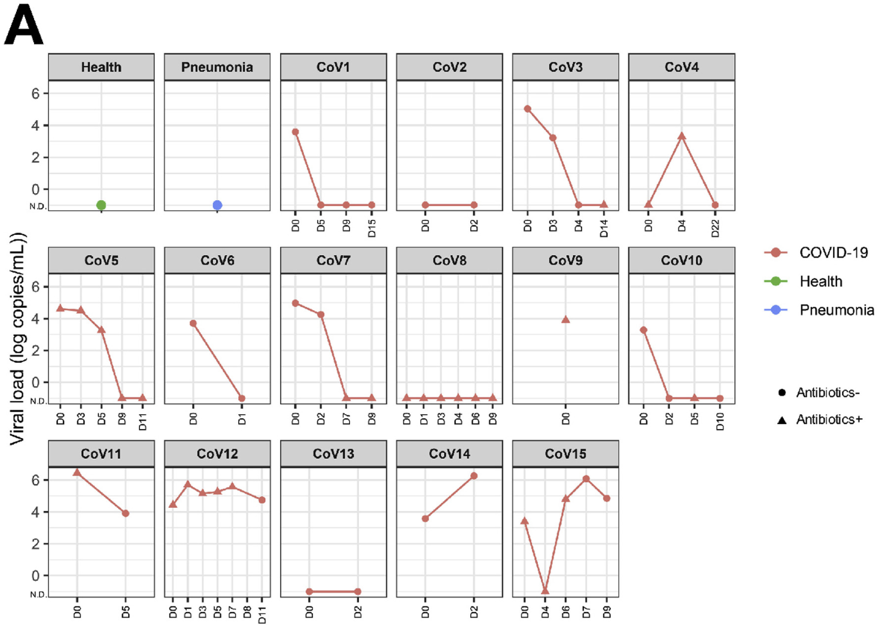
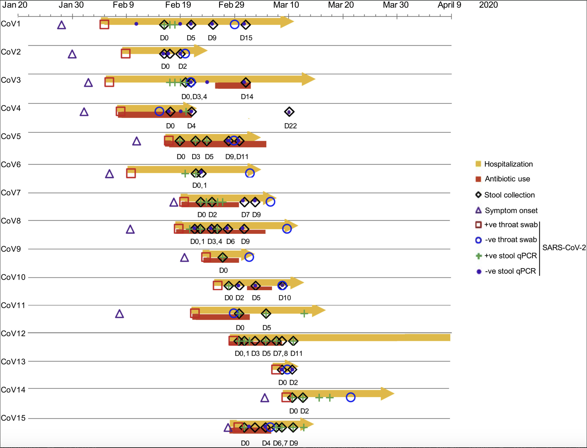

# Extraction for Zuo et al. (2020)
[Zuo et al. (2020)](https://www.gastrojournal.org/article/S0016-5085(20)34701-6/fulltext?referrer=https%3A%2F%2Fpubmed.ncbi.nlm.nih.gov%2F) investigated whether gut bacteria were associated with fecal SARS-CoV-2 load over the course of hospitalization. The authors recorded the dynamic changes of severe acute respiratory syndrome coronavirus 2 (SARS-CoV-2) RNA in fecal specimens from 15 hospitalized COVID-19 patients in Hong Kong. Demographic information (e.g., age, sex, comorbidities) and serial stool test results were collected and analyzed for all patients.
First, we `import` python modules needed:

```python
import yaml
import pandas as pd
from shedding_hub import folded_str
```
The raw data (data.csv) was extracted from [Figure 3C](https://www.gastrojournal.org/cms/10.1053/j.gastro.2020.05.048/asset/63b0fcb5-b3dd-4535-ad0a-d352016f6c5f/main.assets/gr3_lrg.jpg) (see below) in [Zuo et al. (2020)](https://www.gastrojournal.org/article/S0016-5085(20)34701-6/fulltext?referrer=https%3A%2F%2Fpubmed.ncbi.nlm.nih.gov%2F) and entered in the markdown (.md) file.



Analytes `stool_SARSCoV2_ConfirmationDate` and `stool_SARSCoV2_SymptomOnset` represent stool-based SARS-CoV-2 viral load measurements, with time (day) calculated relative to two different reference points: the date of laboratory confirmation and the date of symptom onset, respectively. For cases with known symptom onset, we used `stool_SARSCoV2_SymptomOnset`; otherwise we used `stool_SARSCoV2_ConfirmationDate`. This timing information was extracted from [Figure 1](https://www.gastrojournal.org/cms/10.1053/j.gastro.2020.05.048/asset/aeeaa4c1-291e-4c75-9ecd-780a1a176632/main.assets/gr1_lrg.jpg) (see below) in [Zuo et al. (2020)](https://www.gastrojournal.org/article/S0016-5085(20)34701-6/fulltext?referrer=https%3A%2F%2Fpubmed.ncbi.nlm.nih.gov%2F), which illustrates the timeline of sample collection for each patient and entered in the markdown (.md) file.




```python
zuo2020 = pd.read_csv("data.csv")
zuo2020["type"] = "stool"
zuo2020 = zuo2020.replace({"Sex": {'M': "male", 'F': "female"}})

# Initialize an empty list to store participant information
participant_list = []
# Loop through each unique patient in the patient_demo_info dictionary
for i in pd.unique(zuo2020["ID"]):
    patient_data = zuo2020[zuo2020["ID"] == i]
    age = int(patient_data['Age'].iloc[0])  
    sex = str(patient_data['Sex'].iloc[0]) 

    measurements = []
    for _, row in patient_data.iterrows():
        try:
            if row['value'] == 'negative':
                value = 'negative'
            else:
                value = 10 ** float(row['value']) 

            if value == 1.0:
                value = 'negative'

        except ValueError:
            value = 'negative'

        # Append measurements separately for each analyte type
        if row['ID'] in [10, 12, 13]:
            measurements.append({
                "analyte": "stool_SARSCoV2_ConfirmationDate", 
                "time": int(row['day']), 
                "value": value})
        else:
            measurements.append({
                "analyte": "stool_SARSCoV2_SymptomOnset",
                "time": int(row['day']),
                "value": value
            })


    participant_dict = {
        "attributes": {
            "age": age,
            "sex": sex
        },
        "measurements": measurements
    }
    participant_list.append(participant_dict)
   

```

Finally, the data is formatted and output as a YAML file.

```python
Zuo2020 = dict(title="Alterations in Gut Microbiota of Patients With COVID-19 During Time of Hospitalization",
            doi="10.1053/j.gastro.2020.05.048",
            description=folded_str("The author measured SARS-CoV-2 detected by real-time reverse transcriptase PCR in fecal samples from 15 hospitalized COVID-19 patients in Hong Kong.\n"),
            analytes=dict(
                stool_SARSCoV2_SymptomOnset=dict(description=folded_str("SARS-CoV-2 RNA gene copy concentrations in fecal samples, which were were collected 2 to 3 times per week starting from hospital admission, and SARS-CoV-2 detection in feces was tracked longitudinally. The day is calculated relative to the date of symptom onset. The concentrations were quantified in gene copies per mL.\n"),
                          specimen="stool",
                          biomarker="SARS-CoV-2",
                          gene_target="N1",
                          limit_of_quantification="unknown",
                          limit_of_detection=347,
                          unit="gc/mL",
                          reference_event="symptom onset"),
                stool_SARSCoV2_ConfirmationDate=dict(description=folded_str("SARS-CoV-2 RNA gene copy concentrations in fecal samples, which were were collected 2 to 3 times per week starting from hospital admission, and SARS-CoV-2 detection in feces was tracked longitudinally. The day is calculated relative to the date of SARS-CoV-2 confirmation. The concentrations were quantified in gene copies per mL.\n"),
                          specimen="stool",
                          biomarker="SARS-CoV-2",
                          gene_target="N1",
                          limit_of_quantification="unknown",
                          limit_of_detection=347,
                          unit="gc/mL",
                          reference_event="confirmation date")),
    participants=participant_list,
)


with open("zuo2020alterations.yaml","w") as outfile:
    outfile.write("# yaml-language-server: $schema=../.schema.yaml\n")
    yaml.dump(Zuo2020, outfile, default_style=None, default_flow_style=False, sort_keys=False)
```
